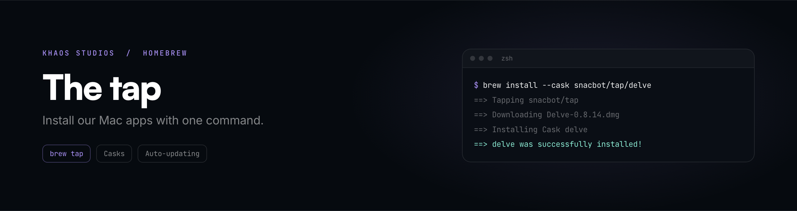

<div align="center">

<a href="https://khaosstudio.com">
  
</a>

<br>

[](Casks)
[](https://khaosstudio.com/delve/specs/)
[](https://khaosstudio.com/delve/specs/)

Homebrew casks for [Khaos Studios](https://khaosstudio.com) apps.

</div>

---

## Install

```sh
brew install --cask snacbot/tap/delve
```

Homebrew adds the tap for you on first use, so there's no separate `brew tap` step.

## Casks

| Cask | App | Requires |
| --- | --- | --- |
| [`delve`](Casks/delve.rb) | **[Delve](https://khaosstudio.com/delve/)**, a disk space analyzer that maps your drive as one interactive treemap | macOS 26+, Apple Silicon |

Delve ships from [snacbot/delve-releases](https://github.com/snacbot/delve-releases). Everything else we make lives at [khaosstudio.com](https://khaosstudio.com).

## Updating on release

Delve auto-updates through Sparkle, so its cask is `auto_updates true` and Homebrew stays out of the in-app updater's way. The cask still needs a version and sha bump each release so fresh installs land on the current build.

```sh
VERSION=0.9.0
SHA=$(curl -sL "https://github.com/snacbot/delve-releases/releases/download/v$VERSION/Delve-$VERSION.dmg" | shasum -a 256 | cut -d' ' -f1)
sed -i '' "s/version \".*\"/version \"$VERSION\"/; s/sha256 \".*\"/sha256 \"$SHA\"/" Casks/delve.rb
```

Verify before pushing. `brew fetch` re-downloads and checks the sha against the cask:

```sh
brew fetch --cask snacbot/tap/delve
```

## Why a tap and not homebrew-cask core

homebrew-cask has a [notability requirement](https://docs.brew.sh/Acceptable-Casks) for new submissions. Once Delve clears it, this same cask file goes upstream and the tap gets retired.

## Links

[Khaos Studios](https://khaosstudio.com)
&nbsp;·&nbsp;
[Delve](https://khaosstudio.com/delve/)
&nbsp;·&nbsp;
[Discord](https://discord.gg/UxfhSWavbQ)
&nbsp;·&nbsp;
[Privacy](https://khaosstudio.com/privacy.html)
